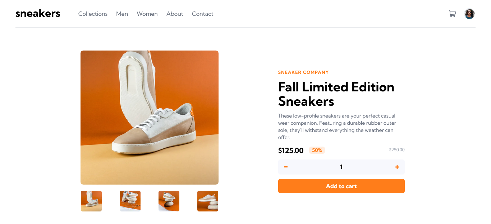

# Frontend Mentor - E-commerce product page solution :rocket:

This is a solution to the [E-commerce product page challenge on Frontend Mentor](https://www.frontendmentor.io/challenges/ecommerce-product-page-UPsZ9MJp6). Frontend Mentor challenges help you improve your coding skills by building realistic projects.

## Table of contents

- [Overview](#overview)
  - [The challenge](#the-challenge)
  - [Screenshot](#screenshot)
  - [Links](#links)
- [My process](#my-process)
  - [Built with](#built-with)
  - [Useful resources](#useful-resources)
- [Author](#author)

## Overview

### :clipboard: The challenge

Users should be able to:

- View the optimal layout for the site depending on their device's screen size
- See hover states for all interactive elements on the page
- Open a lightbox gallery by clicking on the large product image
- Switch the large product image by clicking on the small thumbnail images
- Add items to the cart
- View the cart and remove items from it

### :camera_flash: Screenshot

### :link: Links

- Solution URL: [E-commerce challenge](https://www.frontendmentor.io/solutions/responsive-sneakers-ecommerce-kEnJlZP_cE)
- Live Site URL: [Deploy](https://ecommerce-nextjs-caducoder.vercel.app/)

## My process

### :hammer_and_wrench: Built with

- Semantic HTML5 markup
- Flexbox
- Mobile-first workflow
- [React](https://reactjs.org/) - JS library
- [Next.js](https://nextjs.org/) - React framework
- [Tailwind CSS](https://tailwindcss.com/) - For styles

### :bulb: Useful resources

- [beautiful-react-hooks](https://antonioru.github.io/beautiful-react-hooks/) - This helped me for responsive changes. I really liked this pattern and will use it going forward.

## :speech_balloon: Author

- Website - [portfolio](https://caducoder.vercel.app/)
- Frontend Mentor - [@caducoder](https://www.frontendmentor.io/profile/caducoder)

